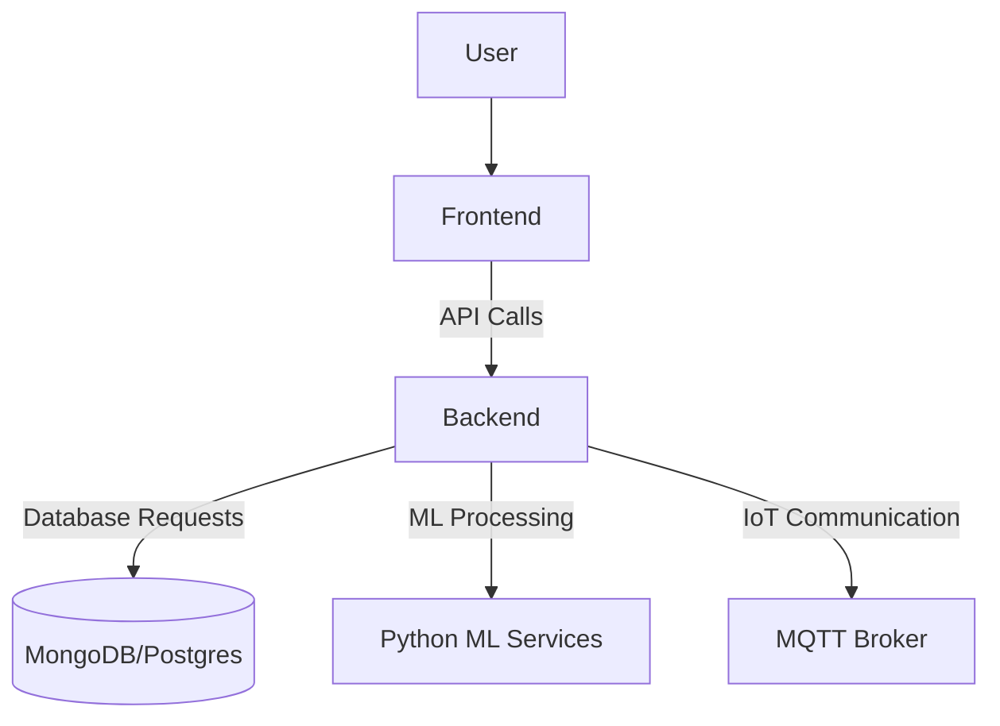

# 🗑️ Waste Management Automation for Dark Stores

 


## 🚀 Project Overview

This repository contains an AI-powered web application that automates waste classification, tracking, and decision-making for dark stores (micro-fulfillment centers). The platform combines rule-based shelf-life classification, machine learning insights, and real-time dashboards to reduce food wastage and improve operational efficiency.

## 🎯 Key Objectives

- 📦 Minimize expired goods using predictive classification
- ♻️ Improve sustainability through waste identification and separation
- 📈 Use data & AI to guide restocking and clearance decisions
- 🧭 Enable store-wise performance tracking with visual dashboards

## 🎯 Core Features

- 🚦 Smart Shelf-Life Classification (Red / Yellow / Green)
- 🗺️ Waste Generation Maps with store heatmaps
- 📦 Real-time inventory monitoring and expiry alerts
- 🤖 AI-powered insights for demand/expiry correlation and clearance recommendations
- 📊 Admin dashboards, reports, and sustainability scoring

## 🛠️ Tech Stack

- Frontend: React.js, Tailwind CSS, Chart.js / Plotly
- Backend: Node.js + Express (API), Python + Flask (ML services)
- Database: MongoDB or PostgreSQL
- AI: TensorFlow / PyTorch, OpenCV for image processing
- Real-time: Socket.io / MQTT for IoT integration

## 🔧 Installation & Quick Start

1. Clone the repository
```bash
git clone https://github.com/OneTeraByte7/Hackron2025.git
cd Hackron2025
```
2. Install server deps
```bash
cd server
npm install
pip install -r requirements.txt
```
3. Install client deps and start
```bash
cd ../client
npm install
npm start
```
4. Start the backend
```bash
cd ../server
node server.js
```

## 📊 System Architecture


## 🖥️ Example Workflows

- Daily shelf-life tagging and database update
```bash
python server/classify_products.py --store_id=store_102
python server/update_inventory_tags.py
python server/run_ai_insights.py --store_id=store_102
curl -X POST http://localhost:5000/refresh-dashboard
```

## 🎥 Demo & Screenshots

Screenshots and demo assets are stored in the repository attachments and build artifacts in `client/build`.

## 📅 Future Enhancements

- Integration with live ordering APIs (e.g., Blinkit)
- Mobile app for on-site tagging
- Auto-schedule waste pickups based on volume thresholds
- Notifications and automated clearance campaigns

---

If you'd like, I can stage and commit this resolved [README.md](README.md) for you and finish the merge. See next steps below.

